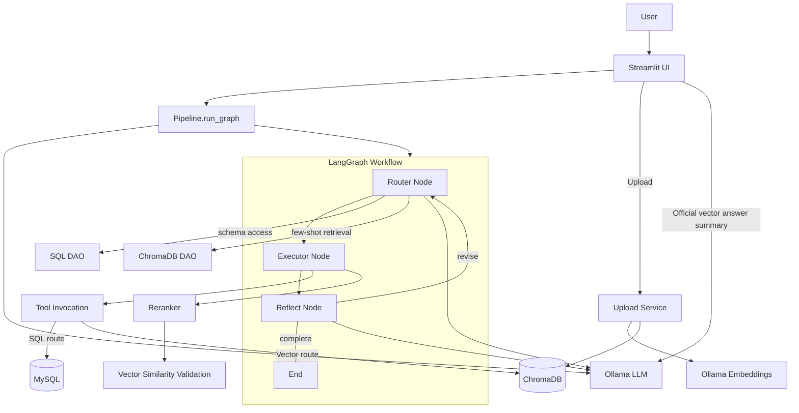
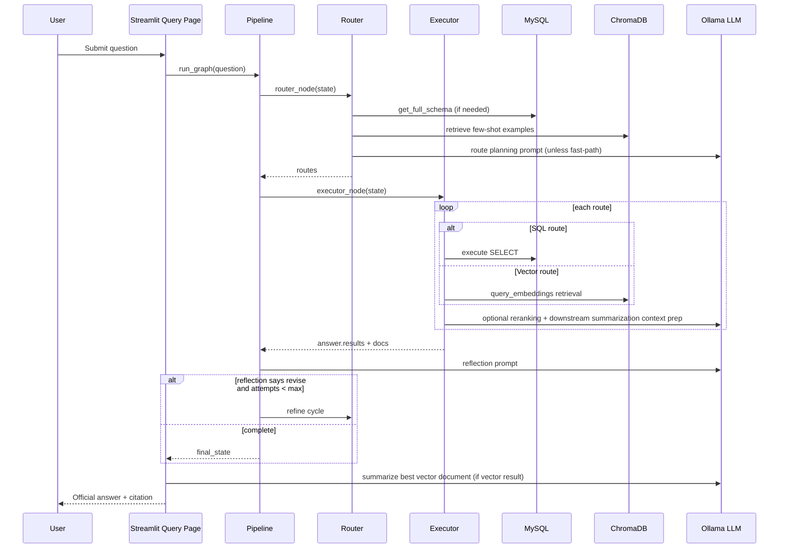

#Capstone Application Design Document

## 1. Purpose and Scope

This document describes the design of this agentic Retrieval-Augmented Generation (RAG) system that combines:

- Structured query answering from MySQL.
- Semantic retrieval from ChromaDB vector collections.
- LLM-based routing, SQL generation/repair, reranking, reflection, and final vector answer summarization.
- Streamlit UI for document upload and question answering.

This is an implementation-level design document intended for engineers maintaining or extending the system.

## 2. System Goals

- Answer business and policy questions by automatically selecting SQL, vector retrieval, or a mixed strategy.
- Minimize user friction by auto-selecting vector collections for query-time retrieval.
- Improve reliability through schema-aware SQL validation and regeneration.
- Improve vector answer quality through similarity threshold validation and final-answer summarization.
- Provide iterative refinement via reflection loops.

## 3. High-Level Architecture

### 3.1 Runtime Components

- Frontend: Streamlit app.
- Application backend: Python process in same container as Streamlit.
- SQL storage: MySQL.
- Vector storage: ChromaDB (HTTP server mode, persistent volume).
- LLM runtime: Ollama for generation and embedding.
- Optional reranking: Cohere Rerank API.

### 3.2 Primary Control Flow

1. User submits query in UI.
2. Pipeline builds and executes a LangGraph with nodes:
   - Router -> Executor -> Reflect
   - Reflect conditionally loops back to Router for refinement (max 2 attempts).
3. SQL and/or vector routes execute.
4. Vector documents are reranked and validated by similarity threshold.
5. UI renders an official answer for vector results by summarizing the best chunk and adding citation.

### 3.3 Architecture Diagram

## 4. Execution Design

### 4.1 Graph State

The graph uses RAGReflectionState fields including:

- question: user input.
- collection_name: selected vector collection.
- routes: planned route list (sql/vector/schema style semantics).
- answer: compiled result payload.
- retrieved_docs: all reranked docs.
- reflection, revised, attempts: refinement loop controls.

### 4.2 Router Node Design

The router performs:

1. Collection auto-selection if collection_name is absent.
2. Tool catalog extraction from registered tools.
3. Live schema retrieval and schema-term extraction (cached with 120s TTL).
4. Few-shot retrieval for:
   - Golden SQL examples from configurable collection.
   - Chain-of-thought reasoning examples from configurable collection.
   Cached with 120s TTL.
5. Fast-path vector routing when:
   - first attempt,
   - collection selected,
   - schema terms exist,
   - and no schema overlap.
6. Otherwise LLM routing using router prompt.
7. Route normalization and canonicalization.
8. SQL route enrichment/regeneration with live schema.
9. SQL no-result safeguard for refinement loops.
10. Collection injection into vector routes.

Fallback behavior exists if JSON parsing fails.

### 4.3 SQL Route Reliability Design

SQL pipeline reliability is achieved with layered safeguards:

- Schema alignment validation:
  - table existence and where-clause columns.
- SQL generation/repair loops:
  - generate with schema prompt,
  - validate,
  - repair with error context,
  - up to bounded retries.
- Execution-time recovery:
  - if unknown table/column errors appear, invoke repair and retry.
- Hard block for invalid SQL:
  - route marked blocked_invalid_sql/regeneration_error and skipped.

### 4.4 Vector Route Design

Vector routes use explicit embedding paths to avoid embedding-function conflicts and dimensional mismatch.

- Query-time retrieval uses query_embeddings from pipeline.embedding_function.
- Ingestion stores documents with explicit embeddings.
- Collection binding avoids embedding function conflict at get_or_create_collection time.
- Distances are converted to normalized similarity via:

  similarity = 1 - distance / 2, clamped to [0, 1]

### 4.5 Reranking and Validation

- Reranker:
  - Cohere rerank model if API key is configured.
  - graceful fallback to original order on errors/missing key.

- Vector validation:
  - Uses vector_similarity_threshold from environment.
  - Computes best similarity from document metadata.
  - If below threshold, returns fallback document with:
    - I could not find related information.

### 45.6 Reflection Loop

- Reflection prompt evaluates answer completeness.
- If reflection is not YES, route refinement continues.
- Max attempts currently capped at 2.

## 5. Frontend Design

### 5.1 Upload Workflow

Upload page supports:

- PDF with text only.
- PDF with images (multi-modal processing path).
- Structured DOCX.
- Unstructured DOCX.

Flow:

1. User selects/creates collection.
2. File is temporarily stored.
3. Processor chunks content.
4. Metadata is enriched with source_file/upload_mode/chunk_index.
5. Embeddings are generated explicitly.
6. Documents + metadata + embeddings are inserted into Chroma.
7. Temp file is deleted.

### 5.2 Query Workflow and Official Answer

For query rendering:

- SQL outputs are shown as tables/text.
- For vector outputs:
  - chunks shorter than configured minimum in query page logic are excluded from best-doc selection,
  - best doc is selected by highest similarity, tie-break lowest distance,
  - official answer is generated by LLM summarization prompt,
  - citation includes document and page metadata.

The official vector answer is intended to avoid raw chunk dumping and provide concise query-specific responses.

## 6. Prompting Strategy

### 6.1 Router Prompt

- Produces route JSON.
- Includes tool catalog, schema context, and few-shot examples.
- Encourages decomposition and mixed-route planning.

### 6.2 SQL Generation/Repair Prompts

- SQL generation prompt: produce one valid SELECT using provided schema.
- SQL repair prompt: repair invalid SQL using DB error + schema context.

### 6.3 Reflection Prompt

- Binary completeness check with explanation.

### 6.4 Vector Final Answer Prompt

- Summarize single best vector chunk in 2-4 sentences.
- Address user question directly.
- End with citation line:
  - More info: <source document>, page <page>

## 7. Data Model and Storage

### 7.1 MySQL

Primary tables in initialization:

- employee
- contracts
- projects
- employee_project

Notes:

- init/schema.sql and seed_data.sql contain comments indicating historical schema/fk inconsistencies and migration notes.
- The runtime SQL schema inspection is the source of truth for route validation.

### 7.2 Chroma Collections

Observed collection classes:

- User-upload collections (runtime selected/created).
- Reserved few-shot collections:
  - golden_sql (configurable by env)
  - cot_reasoning (configurable by env)

Vector metadata typically includes:

- source_file
- page/page_number
- chunk_index
- upload_mode
- distance
- similarity_score

## 8. Configuration Design

Environment-driven configuration includes:

- SQL:
  - sql_db_host, sql_db_port, sql_db_user, sql_db_password, sql_db_name
- Chroma:
  - chroma_db_host, chroma_db_port
  - chroma_db_collection_golden_sql
  - chroma_db_collection_cot_reasoning
- LLM/Embeddings:
  - ollama_host, ollama_port
  - ollama_model_name
  - ollama_embedding_model_name
- Vector validation:
  - vector_similarity_threshold
- Router performance:
  - router_overlap_worker_count
- Upload defaults:
  - upload_text_collection_name
  - upload_multimodal_collection_name
- Reranker:
  - COHERE_API_KEY
  - cohere_rerank_model

## 9. Deployment and Runtime

### 9.1 Containers

docker-compose includes:

- mysql
- chromadb
- ollama
- application (streamlit app)

Volumes are used for persistence.

### 9.2 Application Container

- Python 3.11 slim base image.
- Dependencies installed from requirements.txt.
- Streamlit launched on port 8501.
- Healthcheck on /_stcore/health.

## 10. Performance and Scalability Considerations

- Router caches schema and few-shot sections for 120 seconds.
- Fast-path bypasses LLM routing for clear vector-only queries.
- Optional multiprocessing for schema overlap checks when workload size justifies process overhead.
- Reranking may add latency and external dependency risk when Cohere is enabled.

## 11. Error Handling and Fallbacks

- Router:
  - JSON parsing fallback and deterministic route fallback.
- SQL:
  - schema validation and SQL repair loops.
- Tool invocation:
  - defensive collection_name auto-fill for vector retriever.
- Reranker:
  - no-key/error fallback to original ranking.
- Vector validation:
  - returns explicit no-information fallback answer when below threshold.
- Vector answer summarization:
  - deterministic truncation fallback if LLM summarization fails.

## 12. Security and Compliance Notes

Current repository state indicates sensitive keys in environment config. Recommended actions:

- Remove real API keys from committed .env and rotate compromised keys.
- Use secrets manager or CI/CD secret injection.
- Add .env to ignore patterns and provide .env.example.

Additional recommendations:

- Restrict SQL execution to read-only at DB user level.
- Add query timeout limits for DB and vector operations.
- Add request logging redaction for sensitive prompts/results.

## 13. Known Design Constraints and Risks

- Route generation depends heavily on prompt quality and model output format.
- SQL validation is regex-based and may not cover full SQL grammar complexity.
- Reflection loop can improve quality but increases latency.
- Multi-modal CLIP path introduces heavy model footprint and startup cost.
- Current best-document strategy for vector output may miss multi-chunk answers for complex questions.

## 14. Extensibility Roadmap

1. Introduce typed route/result schemas with Pydantic models across node boundaries.
2. Move UI-side vector summarization into backend node for consistent API behavior across clients.
3. Add observability:
   - tracing for node latency,
   - route decision logs,
   - retrieval/rerank metrics.
4. Add integration tests for:
   - route canonicalization,
   - SQL repair loop,
   - vector threshold behavior,
   - citation rendering.
5. Add configurable chunk filtering thresholds via env rather than UI code constants.

## 15. End-to-End Sequence (Query)

## 16. Operational Runbook (Quick)

### Start

- docker compose up --build application

### Reset persistent state

- docker compose down -v

### Verify app

- Streamlit UI: http://localhost:8501
- ChromaDB: http://localhost:8000
- Ollama API: http://localhost:11434

### Common diagnostics

- Embedding mismatch/conflict:
  - Ensure all query and ingestion paths use explicit embeddings.
  - Ensure collection naming and env values are consistent.
- No vector answer:
  - Check vector_similarity_threshold and top document similarity metadata.
- SQL blocked:
  - Inspect route validation_status and SQL regeneration logs.

## 17. Ownership and Change Guidelines

- Prompt changes should be versioned and tested with route fixtures.
- Any metadata schema change for vector docs must update:
  - ingestion,
  - retrieval,
  - UI source/page extraction.
- Keep similarity conversion logic centralized in one helper to avoid drift.

---

