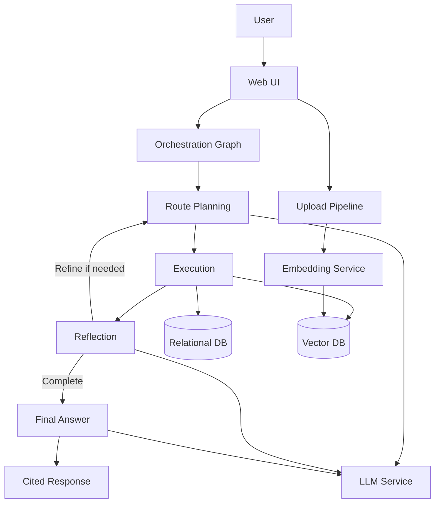
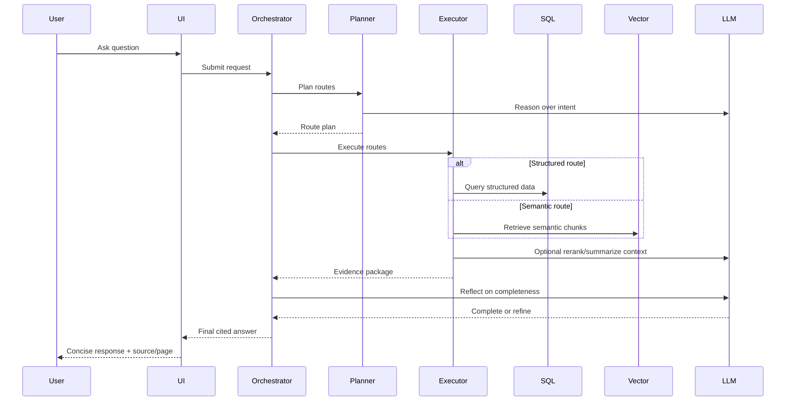

# Capstone System Design Document

## 1. Document Purpose

This document defines the target architecture and design behavior for a hybrid search, agentic RAG application. It is intentionally written as a pre-implementation design artifact, focusing on capabilities, responsibilities, and decision logic rather than code-level details.

## 2. Product Vision

The system should answer enterprise questions by intelligently combining:

- Structured data access (relational database).
- Unstructured knowledge retrieval (vector database).
- LLM-driven planning and synthesis.

The user experience should remain simple: upload knowledge sources, ask questions naturally, and receive concise, cited answers.

## 3. Design Goals

1. Deliver accurate answers for both tabular and narrative queries.
2. Automatically choose the best retrieval strategy (SQL, vector, or mixed).
3. Preserve answer quality through validation, reranking, and iterative reflection.
4. Provide source-aware citations in final answers.
5. Keep the system configurable by environment and deployable in containers.

## 4. Non-Goals

1. This system is not designed for write-back transactional workflows.
2. This system is not intended to execute destructive database operations.
3. This system is not a generic data warehouse orchestration platform.

## 5. High-Level Architecture

### 5.1 Logical Components

- User Interface Layer:
  - Query experience.
  - Document upload and collection management.
- Orchestration Layer:
  - Multi-step reasoning graph for planning, execution, and reflection.
- Retrieval Layer:
  - SQL retrieval for structured requests.
  - Vector retrieval for semantic/policy requests.
- Reasoning Layer:
  - Route planning.
  - SQL generation/repair guidance.
  - Reflection-based refinement.
  - Final answer summarization.
- Quality Layer:
  - Similarity threshold checks.
  - Optional reranking.
  - Output formatting and citation enforcement.
- Data Stores:
  - Relational database for operational records.
  - Vector database for document chunks and embeddings.

### 5.2 Deployment Components

- Application service (web UI + orchestration runtime).
- Relational database service.
- Vector database service.
- LLM/embedding runtime service.

### 5.3 Architecture Diagram

## 6. End-to-End Query Flow

1. User submits a natural-language question.
2. System classifies intent and decomposes into atomic sub-questions.
3. Each sub-question is assigned to:
   - Structured retrieval,
   - Semantic retrieval,
   - or mixed execution path.
4. Retrieval executes and returns candidate evidence.
5. Evidence is optionally reranked.
6. Vector evidence is validated against a similarity threshold.
7. Reflection evaluates completeness and may trigger one refinement loop.
8. Final response is generated as concise user-facing text with source citations.

## 7. Routing Design

### 7.1 Routing Principles

- Prefer structured retrieval when query intent maps to known schema entities.
- Prefer semantic retrieval for policy, guideline, or narrative requests.
- Use mixed routing when a question combines both structured and unstructured intent.

### 7.2 Decomposition Policy

- Break compound questions into independent sub-questions.
- Ensure each sub-question can be handled by one retrieval mode.
- Preserve traceability from each sub-question to its evidence.

### 7.3 Fallback Strategy

- If route generation is uncertain, use deterministic heuristics:
  - schema overlap suggests structured path,
  - otherwise semantic path.
- If parsing/planning fails, return safe, minimal fallback routes.

## 8. Structured Retrieval Design

### 8.1 Safety and Reliability

- Enforce read-only query intent.
- Validate table and column references against live schema metadata.
- Attempt bounded regeneration/repair when schema mismatches occur.
- Block invalid structured queries when they cannot be safely repaired.

### 8.2 Schema Awareness

- Maintain live schema context for planning quality.
- Use schema context as authoritative source for validation.

## 9. Semantic Retrieval Design

### 9.1 Embedding Consistency

- All query and ingestion paths must use explicit embedding generation.
- Retrieval should avoid implicit server-side embedding defaults that can cause dimensional mismatch.

### 9.2 Collection Selection

- Prefer automatic collection selection for query-time retrieval.
- Exclude designated system collections (for few-shot examples) from user-answer retrieval.

### 9.3 Similarity Handling

- Retrieval returns distances from vector search.
- Distances are normalized to a 0-1 similarity scale for downstream quality logic.
- Similarity threshold is configurable; below-threshold evidence is rejected.

## 10. Answer Quality Design

### 10.1 Candidate Quality Controls

- Optional reranking improves candidate ordering.
- Threshold validation prevents low-confidence semantic answers.
- Short or low-information chunks may be filtered from final-answer selection.

### 10.2 Final Answer Composition

- For semantic answers, select the strongest evidence chunk using:
  - highest similarity,
  - then lowest distance as tie-breaker.
- Generate concise answer text targeted to the user question.
- Do not present raw retrieved chunk text as the final answer.
- Always include source citation with document and page when available.

### 10.3 Reflection-Based Refinement

- Evaluate whether the answer fully addresses the question.
- Allow bounded iterative refinement to improve completeness.

## 11. Upload and Knowledge Ingestion Design

### 11.1 Supported Content Types

- PDF (text-focused).
- PDF (multi-modal content including images).
- DOCX (structured and unstructured extraction options).

### 11.2 Ingestion Pipeline

1. Accept file upload.
2. Parse and chunk content.
3. Enrich metadata (source file, page, chunk index, mode).
4. Generate embeddings explicitly.
5. Store chunk text, metadata, and embeddings in selected collection.

### 11.3 Metadata Requirements

Minimum metadata fields for citation-quality outputs:

- source file identifier.
- page or section indicator.
- chunk index.
- retrieval scores (distance/similarity).

## 12. Data Model Considerations

### 12.1 Relational Domain

Representative entities include employee, contract, project, and assignment relationships. The system assumes schema can evolve and therefore depends on runtime schema introspection rather than static SQL assumptions.

### 12.2 Vector Domain

Vector collections should be segmented by knowledge domain and use consistent embedding models. Reserved collections may store curated examples for planning support and should not be mixed into normal user retrieval.

## 13. Prompting Strategy

### 13.1 Planning Prompt

- Produces machine-readable route plans.
- Includes tool context, schema context, and few-shot examples.
- Emphasizes decomposition and route rationale.

### 13.2 Structured Query Prompting

- One prompt family for generating structured read queries.
- One prompt family for repairing invalid structured queries with schema/error context.

### 13.3 Reflection Prompting

- Binary completeness assessment with concise explanation.

### 13.4 Final Semantic Answer Prompting

- Summarize strongest evidence into concise response.
- Address user question directly.
- Enforce citation line format.

## 14. Configuration Model

The system should be fully driven by environment configuration for:

- database connectivity,
- vector database connectivity,
- LLM model and embedding model,
- similarity threshold,
- performance knobs (such as parallel overlap checks),
- default upload collection names,
- reserved few-shot collection names,
- optional reranker configuration.

## 15. Operational Characteristics

### 15.1 Performance

- Cache expensive planning context (schema and few-shot examples).
- Use fast-path routing when intent is clearly semantic.
- Enable selective parallelism only when workload justifies overhead.

### 15.2 Reliability

- Graceful fallback behavior for reranker/LLM failures.
- Deterministic fallback routes when planning output is invalid.
- Defensive handling for missing collection selection.

### 15.3 Observability

- Log route decisions, validation outcomes, and fallback events.
- Track retrieval confidence metrics for troubleshooting.

## 16. Sequence Diagram

