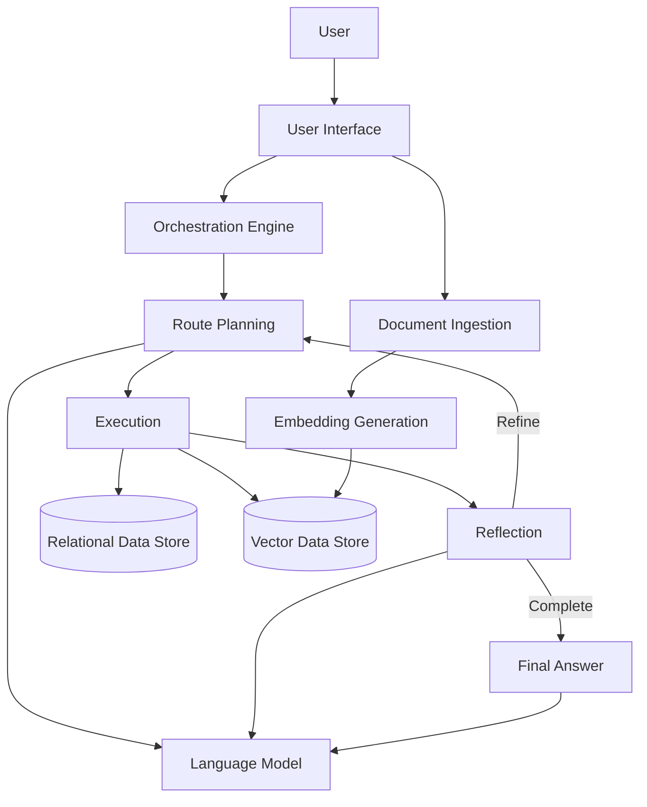
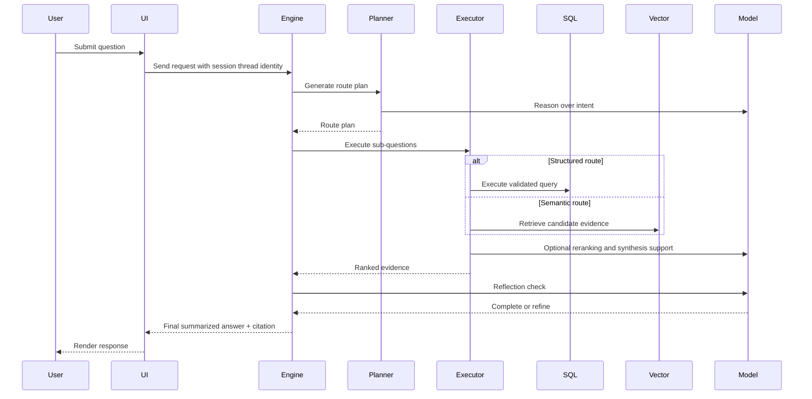

# System Design Document

## 1. Purpose

This document defines the pre-implementation architecture, requirements, and delivery plan for an enterprise question-answering platform that combines structured data retrieval, unstructured knowledge retrieval, and language-model reasoning.

## 2. Product Scope

The product will allow users to:

- Upload enterprise documents into searchable knowledge collections.
- Ask natural-language questions.
- Receive concise, source-aware answers.
- Ask follow-up questions within the same conversational session.
- View session-scoped chat history between user and assistant turns without exposing internal tool/debug messages.

The system will support both:

- Structured retrieval from a relational data source.
- Semantic retrieval from a vector knowledge store.

## 3. Design Objectives

1. Provide accurate answers across both structured and unstructured enterprise domains.
2. Select the best retrieval strategy automatically (structured, semantic, or mixed).
3. Preserve response quality through validation, reranking, and reflection.
4. Enforce safety controls for sensitive identifier handling.
5. Preserve conversational continuity for follow-up questions.
6. Keep deployment cloud-ready and container-compatible.

## 4. Out of Scope

1. Transactional write-back workflows to operational systems.
2. Destructive data operations through user prompts.
3. Full business-process orchestration across external systems.

## 5. High-Level Architecture

### 5.1 Logical Layers

- Experience Layer:
  - Document upload workflow.
  - Query and follow-up interaction workflow.
- Orchestration Layer:
  - Route planning.
  - Multi-step execution.
  - Reflection-driven refinement.
- Retrieval Layer:
  - Relational query execution for structured intents.
  - Vector similarity retrieval for semantic intents.
- Quality Layer:
  - Schema validation.
  - Similarity thresholding.
  - Candidate reranking.
  - Answer summarization and citation formatting.
- Safety Layer:
  - Prompt-level sensitive-input checks.
  - Response-level sensitive-content suppression.
- Data Layer:
  - Relational database.
  - Vector database.

### 5.2 Deployment Components

- Web application service.
- Relational database service.
- Vector database service.
- Model inference service.

### 5.3 Architecture Diagram

## 6. End-to-End Query Lifecycle

1. User submits a question.
2. System blocks prompt input that violates sensitive-identifier policy before orchestration.
3. System loads session context, bounded recent chat turns, and conversation thread identity.
4. System resolves follow-up references into a standalone effective question when context is required.
5. Planner prepares cached routing context (schema and few-shot examples) and decomposes the effective question into one or more sub-questions.
6. Each sub-question is assigned a retrieval path using fast-path, model-driven routing, or deterministic fallback routing.
7. Retrieval executes routes concurrently and returns candidate evidence.
8. Candidate evidence is validated and reranked per route, then consolidated.
9. Reflection checks completeness and decides whether to refine.
10. Final answer is synthesized and returned with source attribution.

## 7. Routing Strategy

### 7.1 Routing Principles

- Prefer structured retrieval when intent maps to known schema entities.
- Prefer semantic retrieval for policy, guideline, and narrative content.
- Use mixed execution when a question spans structured and unstructured domains.
- Short-circuit to semantic-only fast-path when schema overlap is absent on the first attempt.
- Resolve pronoun-based or referential follow-up turns into a standalone effective query before route planning.

### 7.2 Decomposition Rules

- Split compound questions into atomic sub-questions.
- Keep each sub-question independently answerable.
- Preserve traceability from each sub-question to its evidence.

### 7.3 Fallback Behavior

- If planning output is invalid, apply deterministic fallback routing.
- If structured retrieval is invalid at planning or runtime, route to semantic retrieval.
- If no reliable route is available, return a bounded safe response.

## 8. Structured Retrieval Design

### 8.1 Validation and Guardrails

- Validate generated queries against live schema metadata.
- Reject unknown tables and unknown columns.
- Apply bounded repair attempts for recoverable schema-resolution issues.
- Reroute to semantic retrieval when structured path remains invalid.

### 8.2 Reliability Controls

- Restrict to non-destructive query intent.
- Record structured route validation outcomes for observability.
- Prevent invalid structured errors from becoming user-visible failures.

## 9. Semantic Retrieval Design

### 9.1 Collection Management

- Segment vector collections by knowledge domain.
- Reserve system collections for planning examples and reasoning aids.
- Exclude reserved collections from user-facing retrieval.
- Auto-select user-facing collections when collection input is absent.

### 9.2 Retrieval Quality

- Normalize distance scores to comparable similarity values.
- Enforce configurable similarity thresholds.
- Reject below-threshold evidence before answer generation.

### 9.3 Multi-Modal Ingestion

- Process PDF documents through a multi-modal path.
- Preserve text and image-derived evidence.
- Store page metadata with human-readable numbering.

## 10. Answer Quality Design

### 10.1 Candidate Ordering

- Apply reranking after retrieval and normalization.
- Keep fallback behavior when reranking service is unavailable.

### 10.2 Final Response Composition

- Build one comprehensive final answer that addresses the full user question, even when execution uses multiple sub-questions.
- Synthesize across consolidated SQL and semantic evidence gathered from relevant routes.
- Produce concise summaries, not verbatim chunk dumps.
- Include source and page citations for the most relevant supporting evidence.
- Keep sub-question and per-route evidence in raw/debug output only, not in the primary user-facing answer.
- Render structured SQL results as an actual table when the user explicitly requests tabular output.

### 10.3 Reflection Loop

- Evaluate completeness after execution.
- Permit bounded refinement iterations.
- Stop when answer is complete or attempt limit is reached.
- Reuse cached reflection outcomes for repeated question-answer states within the same session thread.

## 11. Conversation and Session Design

### 11.1 Conversation Memory

- Persist orchestration checkpoints across turns within the same session thread.
- Reuse the same session thread identity for follow-up questions.
- Regenerate session thread identity only on explicit user reset.
- Persist bounded user/assistant chat history for session-scoped transcript rendering.
- Exclude internal tool/debug/system messages from the user-visible chat transcript.
- Provide recent transcript turns to orchestration for follow-up question resolution.

### 11.2 Session Controls

- Provide a visible session reset control in the query experience.
- Surface active session identity for troubleshooting continuity.
- Clear session-scoped answer state, feedback state, and chat transcript state on reset.

## 12. Ingestion and Metadata Design

### 12.1 Supported Inputs

- PDF documents.
- Structured and unstructured word-processing documents.

### 12.2 Ingestion Stages

1. File acceptance and temporary storage.
2. Content extraction and chunking.
3. Metadata enrichment.
4. Embedding generation.
5. Storage of documents, metadata, and vectors.

### 12.3 Metadata Requirements

Minimum metadata should include:

- Source document identifier.
- Page or section reference.
- Chunk index.
- Retrieval scoring fields.

## 13. Safety and Compliance Requirements

### 13.1 Sensitive Identifier Policy

- The system must deny requests for social security numbers.
- The system must deny prompt input containing social security number values.
- The system must return a fixed policy message for denied requests.

### 13.2 False-Positive Reduction

- Response suppression logic should rely on contextual detection, not standalone numeric patterns.
- Metadata scanning should avoid broad dictionary stringification to reduce accidental matches.

## 14. Configuration Requirements

The system should be configurable for:

- Relational service connectivity.
- Vector service connectivity.
- Model selection for generation and embeddings.
- Similarity thresholds.
- Reranking model configuration.
- Parallelism and retry limits.
- Reserved collection names.
- Router and reflection cache limits and cache TTLs.

## 15. Operational Characteristics

### 15.1 Performance

- Cache expensive planning context where safe using shared in-memory cache utilities.
- Use fast-path routing when schema overlap is clearly absent.
- Execute independent route retrieval concurrently with bounded worker settings.
- Limit parallelism to workloads where overhead is justified.

### 15.2 Reliability

- Apply graceful fallback behavior for external model and reranking failures.
- Ensure deterministic behavior under partial dependency failure.
- Minimize user-visible internal errors.

### 15.3 Observability

- Log route decisions and fallback reasons.
- Log validation status and retrieval confidence markers.
- Log node-level timing metrics for router, executor, and reflection stages.
- Log cache-hit indicators for reflection reuse diagnostics.
- Track session-level continuity indicators for debugging.

## 16. Sequence Diagram

## 17. Risks and Mitigations

### 17.1 Retrieval-Route Mismatch

Risk:

- Planner routes to an incorrect retrieval mode.

Mitigations:

- Schema-overlap heuristics.
- Route validation safeguards.
- Deterministic fallback policy.

### 17.2 Follow-Up Context Drift

Risk:

- Follow-up questions lose conversational context.

Mitigations:

- Persistent checkpoint memory keyed by stable session thread identity.
- Explicit reset workflow to bound session lifetime.

### 17.3 Low-Confidence Semantic Responses

Risk:

- Irrelevant chunks produce incorrect answers.

Mitigations:

- Similarity thresholding.
- Reranking.
- Reflection and bounded refinement.

### 17.4 Sensitive Data Leakage

Risk:

- Sensitive identifiers appear in prompt or response.

Mitigations:

- Prompt blocking.
- Response suppression checks.
- Fixed policy response.
